## Reproductibilité de la recherche:   phénomène et bonnes pratiques

 
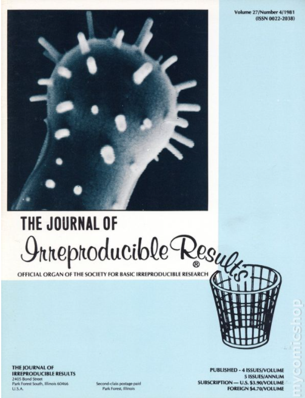

 
**Objectifs**

 

Formation 1

- Comprendre ce qu'est la reproductibilité de la recherche
- Connaître les bonnes pratiques

 
Formation 2

- Se familiariser avec RStudio et le package RMarkdown pour générer des documents dynamiques

 
[Journal of Irreproducible Results (1955 Society of Basic Irreproducible Research)](https://en.wikipedia.org/wiki/Journal_of_Irreproducible_Results)

---

## La "crise" de la reproductibilité

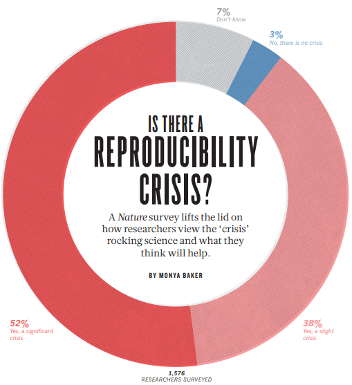

[1,500 scientists lift the lid on reproducibility, Nature, Vol. 533, No. 7604](https://www.nature.com/news/1-500-scientists-lift-the-lid-on-reproducibility-1.19970)

## La "crise" de la reproductibilité

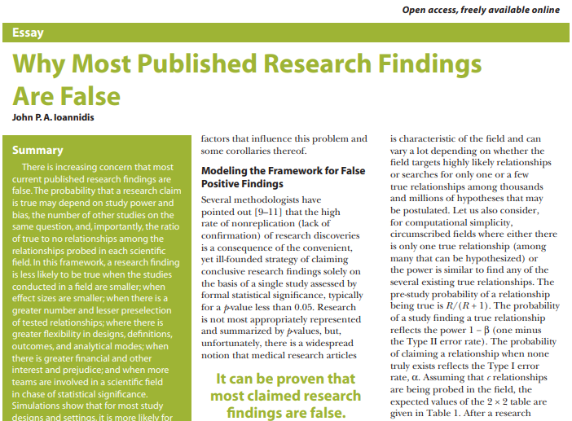

[Ioannidis, 2005](https://journals.plos.org/plosmedicine/article?id=10.1371/journal.pmed.0020124)

- Un grand nombre d'articles ont été publiés au sujet de cette "crise" depuis bon nombre d'années.
- De nombreux débats ont cours dans toutes les disciplines.

## La "crise" de la reproductibilité

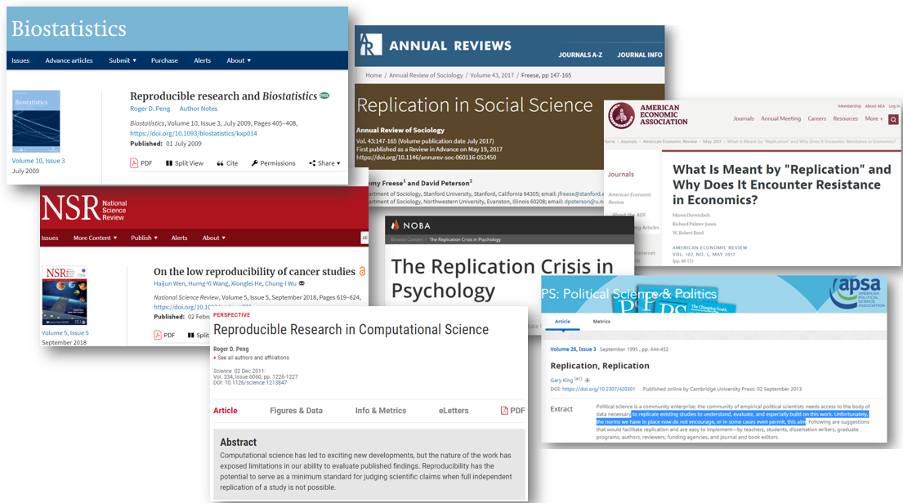

## Débordement dans la "culture populaire"

## Débordement dans la "culture populaire"

<iframe width="560" height="315" src="https://www.youtube.com/embed/FLNeWgs2n_Q" frameborder="0" allowfullscreen></iframe>

## Constat #1 : l'article ne suffit plus

> “an article about computational result is advertising, not scholarship. The actual scholarship is the full software environment, code and data, that produced the result.” [Claerbout cité par in Buckheit and Donoho, 1995](https://statweb.stanford.edu/~wavelab/Wavelab_850/wavelab.pdf)

Principe à la base de la reproductibilité est que l'unité traditionnelle de la diffusion scientifique, ie l'article publié, n'est que la pointe de l'iceberg du processus de recherche.

**[*The Scientific Paper Is Obsolete. Here's what's next*](https://www.theatlantic.com/science/archive/2018/04/the-scientific-paper-is-obsolete/556676/)**

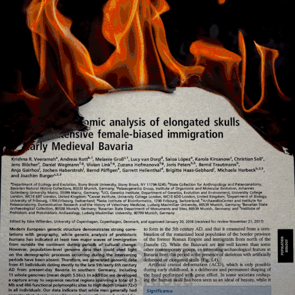

## Constat #2 : les données ne suffisent plus non plus

 

[**"Open is not enough"**](https://www.nature.com/articles/s41567-018-0342-2)

> "[...¸] openness alone does not guarantee reproducibility or reusability, so it should not be pursued as a goal in itself. Focusing on data is also not enough: it needs to be accompanied by software, workflows and explanations, all of which need to be captured throughout the usual iterative and closed research lifecycle, ready for a timely open release with the results."

 

### Le partage de jeux de données est nécessaire à la reproductibilité, mais n'en est pas garant:

–	**Pas capable de l'ouvrir!**

–	**Comprend rien!**

–	**Marche pas!**

<a href="https://tenor.com/view/smarty-pants-what-is-this-cats-kittens-cute-gif-16668757">Smarty Pants What Is This GIF</a> from <a href="https://tenor.com/search/smartypants-gifs">Smartypants GIFs</a>

## Reproductibilité? Réplicabilité? Répétabilité? De quoi parle-t-on?
 

- On retrouve de nombreuses définitions, très variables, voire contradictoires, entre et au sein même des disciplines

 

En résumé ([Barba, 2018](https://arxiv.org/abs/1802.03311)):

***Reproducible**: Authors provide all the necessary data and the computer codes to run
the analysis again, re-creating the results.*

***Replication**: A study that arrives at the same scientific findings as another study, collecting new data (possibly with different methods) and completing new analyses.*

 

Bref, une recherche est *reproductible* si tout le matériel (documentation, analyses, données, code)  est rendu disponible de façon à ce qu'un chercheur indépendant soit en mesure de reproduire les résultats originaux.

 

À noter, en sciences sociales (qualitatives), on parle généralement plus de "réflexivité" que de reproductibilité, c'est à dire "soumettre à une analyse critique non seulement sa propre pratique scientifique (opérations, outils et postulats), mais également les conditions sociales de toute production intellectuelle".  [Rui](https://journals.openedition.org/sociologie/1584#entries) 

 

Voir [*The Turing Way*](https://the-turing-way.netlify.app/welcome.html)

## Reproductibilité? Réplicabilité? Répétabilité? De quoi parle-t-on?

**Petit historique**:

- Première apparition de la notion de "recherche reproductible" en 1992 par [Claerbout](http://sep.stanford.edu/oldsep/matt/join/redoc/web/seg92.html).

> "Our basic goal is reproductible research. The electronic document is our means to this end".

- Philosophie et méthodologie adoptées par [Buckheit and Donoho (1995)](https://statweb.stanford.edu/~wavelab/Wavelab_850/wavelab.pdf)

> “reproducibility of experiments in seismic exploration requires having the complete software environment available in other laboratories and the full source code available for inspection, modification, and application under varied parameter settings.”

- Distinction de **réplication** [Peng 2006](https://academic.oup.com/aje/article/163/9/783/108733) : 

> “The replication of important findings by multiple independent investigators is fundamental to the accumulation of scientific evidence. Researchers in the biologic and physical sciences expect results to be replicated by *independent data, analytical methods, laboratories, and instruments*.”

MAIS, toutes les recherches ne sont pas "réplicables"...

> "An attainable minimum standard is “reproducibility,” which calls for data sets and software to be made available for verifying published findings and conducting alternative analyses."

#### Donc, elles devraient être au **minimum "reproductibles"**.

## La reproductibilité comme *spectrum*

 

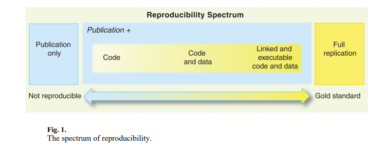

[Reproducible Research in Computational Science, Peng, 2011](https://www.ncbi.nlm.nih.gov/pmc/articles/PMC3383002/)

 

Certains vont plus loin en distinguant différents types de reproductibilité: empirique, méthodologique, statistique, informatique, ... [Stodden, 2018](https://web.stanford.edu/~vcs/talks/UDel-2018-STODDEN.pdf)

 

La reproductibilité n'est pas gage de "résultats scientifiques", mais de **transparence**. Les "mauvaises analyses" peuvent aussi être reproductibles!

## Les causes de la "crise"

- Les causes sont nombreuses et ne sont pas nécessairement liées à une intention de « fraude scientifique ».
- Défaut de maitriser pleinement certaines méthodes et outils > Complexité croissante des modèles d'analyses, des outils, des bases de données.
- Pression accrue sur les chercheurs (*publish or perish*) peut encourager certaines conduites "hasardeuses" qui mettent en péril l’intégrité scientifique.

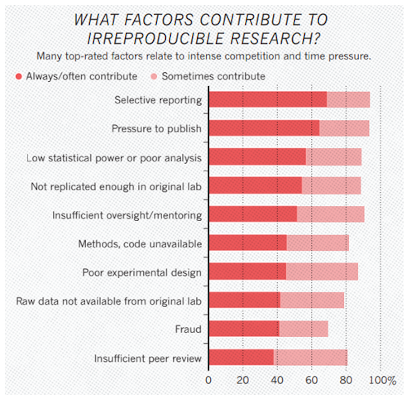

[1,500 scientists lift the lid on reproducibility](https://www.nature.com/news/1-500-scientists-lift-the-lid-on-reproducibility-1.19970)

## Les causes de la "crise"

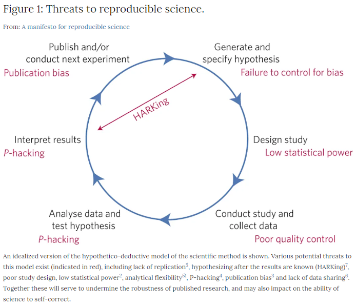

[A manifesto for reproducible science, 2017](https://www.nature.com/articles/s41562-016-0021)

## Initiatives pour changer les "cultures scientifiques"

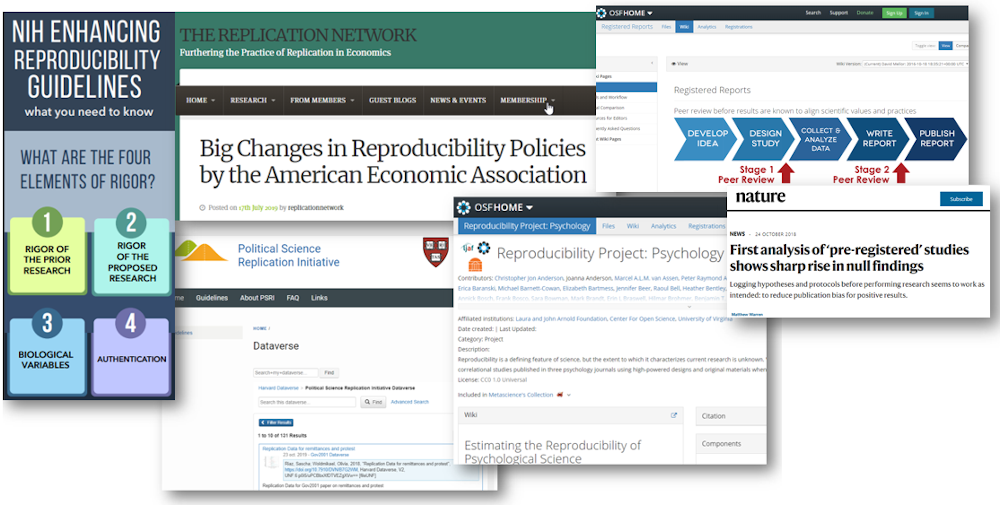

- Organismes subventionnaires: [NIH](https://grants.nih.gov/policy/reproducibility/guidance.htm)
- Éditeurs et associations scientifiques: [American Economic Association](https://replicationnetwork.com/2019/07/17/big-changes-in-reproducibility-policies-by-the-american-economic-association/)
- Création de réseaux de "réplication": [Political science Replication Network](https://replicationnetwork.com/tag/political-science-replication/), [OSF - Many Labs](https://osf.io/8cd4r/)
- Préenregistrement d'études: [OSF - Registered Reports](https://osf.io/rr/)

## Les solutions

- Développer bonnes pratiques à toutes les étapes du cycle de vie de la recherche. 
- Certaines peuvent nécessiter des compétences techniques plus avancées, mais la reproductibilité repose avant tout sur un changement de culture. 
- Le but n'est pas de se fixer des objectifs inateignables, mais d'améliorer ses pratiques.
- Il faut passer outre l'impression de perdre son temps, même si ce travail ingras est encore malheureusement peu reconnu dans beaucoup de disciplines.

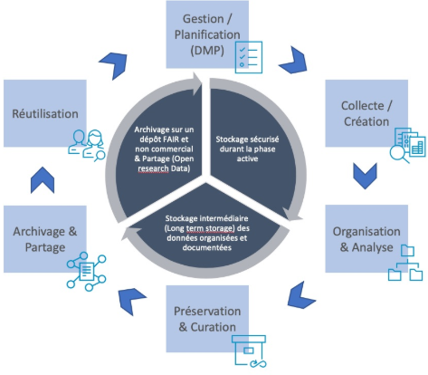

[INIS - Cycle de vie des données](https://www.unil.ch/openscience/home/menuinst/open-research-data/les-donnees-de-recherche/cycle-de-vie-et-types-de-donnees.html)

## Les bénéfices de la reproductibilité 

- Permet le développement de meilleures méthodes de travail comme une **meilleure organisation de ses fichiers** et **une meilleure documentation de ses analyses**.

- Encourage l'apprentissage d'outils qui facilitent la révision, les corrections, les ajouts de nouvelles données et ce sans avoir à recommencer le travail. 

- Évite la **duplication** pour se concentrer sur la création de nouveaux savoirs.

- Facilite la **collaboration** menant à de nouveaux développements (nouveaux collègues, assistants de recherche, ...)

- Facilite l'aller-retour entre les différentes étapes du processus de recherche : collecte de données, analyses, présentation des résultats = **processus itératif**.

- Les résultats de recherche reproductibles sont plus utiles donc **plus utilisés** ce qui assure au chercheur un plus grand **impact scientifique**. 

- Ultimement, incite à un travail de plus grande qualité. Même lorsque les données ne peuvent être partagées, la reproductibilité assure une **meilleure documentation** du processus de collecte et d'analyse.

## Quelques bonnes pratiques

- Il faut à la base se poser la question fondamentale: 

 

**De quoi aurait besoin un collègue qui voudrait reproduire mes résultats sans mon aide?**

 

## Quelques bonnes pratiques

 

### 5 volets essentiels à considérer:

> 1. Planifier
> 2. Organiser
> 3. Documenter
> 4. Automatiser
> 5. Diffuser

## Bonne pratique #1: Planifier!

- Il faut penser à long terme dès le départ.

- Les chercheurs ne se mettent souvent à penser aux exigences de la reproductibilité qu'au moment de publier un article, lorsque l'éditeur demande des révisions ou lorsqu'un autre chercheur demande accès à son matériel. 

- Entraine beaucoup plus de travail que d'y penser dès le départ. 

- Tout commence avec un [plan de gestion de données de recherche](https://assistant.portagenetwork.ca/?locale=fr)

## Bonne pratique #2: Organiser!

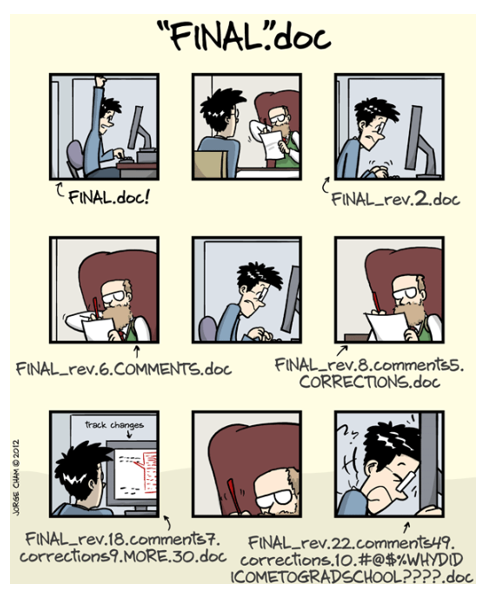

 
 

#### Faut penser dès le départ à un système pour gérer ses fichiers. 
 

#### Les fichiers vont s’accumuler, évoluer avec le temps tout comme les relations entre eux. 
 

#### Il faut donc s’armer contre le chaos!
 

## Bonne pratique #2: Organiser!

### 2.1	Créer un dossier *Projet* contenant tous les fichiers 

-	Structurer en **sous dossiers** pour bien diviser les différents types de fichiers produits (fichiers de code, graphiques, résultats, données, documentation ...).

-	TOUJOURS séparer les **données brutes** (fichier sacré! Ne jamais modifier et conserver pour toujours) des *outputs* (données dérivées/modifiées, générées par analyses...).

- Déterminer ce que l'on fait des anciens fichiers (supprimer, archiver?).

-	Zipper son projet complet avec dates lorsque l’on y a fait des changements majeurs ou à intervalle régulier.

- Développer de bonnes pratiques de sauvegarde tout au long du projet (**règle du 3, 2, 1**).

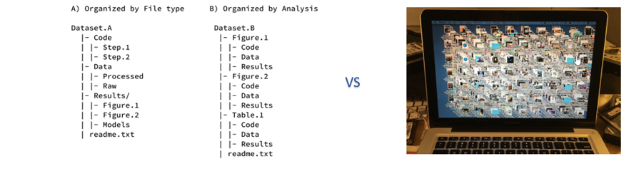

## Bonne pratique #2: Organiser!

### 2.2	Règles de nommage de fichiers

-	Voir les noms de fichiers comme des métadonnées > pas seulement un identifiant mais une description du contenu.
-	Les fichiers README sont utiles mais encore mieux que les noms de fichiers soient descriptifs (*self-documentating*)
-	L’important est de définir une stratégie et de l’appliquer de façon constante.

#### Conseils de base :

-	Noms descriptifs mais pas trop long en évitant les mots vides (+ de 31 caractères peut poser problème sur certains systèmes d’exploitation).
-	Pas de signes diacritiques (accents, trémas, cédilles), de caractères spéciaux, de ponctuation, ni d’espaces.
-	Utiliser _ pour délimiter unité de métadonnées et – pour séparer mots (facilite extraction : *globbing, regex*)
-	Inclure la date de sauvegarde dans un format standardisé (AAAAMMJJ ou AAAA_MM_JJ).
-	Inclure un numéro de version du document incrémenté selon son évolution (Commencer par 0 : 01, 02…)
-	Commencer par du numérique pour faciliter le tri  (ordre chronologique ou logique).
- Bref, des noms significatifs, faciles à chercher, extraire, trier.

## Bonne pratique #2: Organiser!

### 2.2	Règles de nommage de fichiers

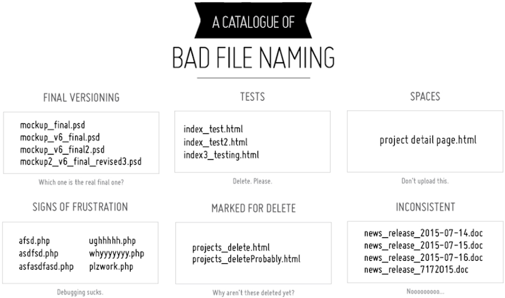

- [*Catalog of Bad File Naming*](http://20px.com/blog/2015/07/16/catalogue-bad-file-naming/)

- [Bonnes pratiques de base](https://datacarpentry.org/rr-organization1/01-file-naming/index.html)

- [Outils de renommage](https://www.bulkrenameutility.co.uk/) 

## Bonne pratique #2: Organiser!

### 2.3	Contrôle des versions

Définir des procédures de gestion de versions de l'ensemble de ses fichiers

1.	Le problème peut se gérer grâce aux règles de nommage.
2.	Mais pour un contrôle plus serré de projet plus volumineux, utiliser un outil de versionnage comme Git ([dropbox](https://help.dropbox.com/fr-fr/files-folders/restore-delete/version-history-overview) et [Google Drive](https://support.google.com/drive/answer/2409045?co=GENIE.Platform%3DDesktop&hl=en#) offre un contrôle de versions minimal).

- Logiciel libre à installer sur son poste qui fonctionne par ligne de commandes (la courbe d'apprentissage est assez raide, il existe par contre des ["clients Git"](https://happygitwithr.com/git-client.html) qui peuvent faciliter les choses. Très bonne intégration avec RStudio). 
- Souvent utiliser conjointement avec une plateforme web comme GitLab ou GitHub permettant la synchronisation des fichiers sur son poste et le travail collaboratif sur un projet.
- Permet un archivage pratique des versions bien définies de ses fichiers.

**Voir** [**Happy Git and GitHub for the useR**](https://happygitwithr.com/)

## Bonne pratique #3: Documenter/commenter!

**Tout, tout, tout documenter**

- Expliquer ce qu'on a fait, comment et pourquoi à chaque étape ayant mené à ses résultats.
- Peut prendre différentes formes, le but est de produire une documentation détaillée,  compréhensible et accessible. 
- Inclure un Fichier [README](https://data.research.cornell.edu/content/readme) dans le dossier principal qui explique l'objectif de la recherche, les responsables, une image de la structure du dossier, format de citation, description de l'environnement technologique (logiciels, versions, système d'exploitation, dépendances...) et le TENIR À JOUR.
- Inclure un fichier README dans chaque sous-dossiers pour documenter son contenu, comment il a été produit et les relations entre les différents fichiers.
- Fournir de l’information détaillée sur son environnement informatique > ne surtout pas sous-estimer l’impact d'un changement de machine sur des résultats d’analyse (*dependency hell*!*)
- Inclure toute l’information descriptive possible sur la source des données primaires pour en assurer la traçabilité [(*provenance*)](https://link.springer.com/referenceworkentry/10.1007%2F978-0-387-39940-9_1305)

*La plupart des logiciels ont un grand nombre de dépendances qui peuvent entrainer des conflits si l’installation n’est pas identique. Dans R il est essentiel d’inclure son sessionInfo() mais ne signale pas toutes les dépendances système de plus haut niveau. Il existe des outils plus sophistiqués pour les identifier (gestionnaires de paquets comme Packrat pour R, outils de "conteneurs logiciels" comme Docker...)

## Bonne pratique #3: Documenter/commenter!

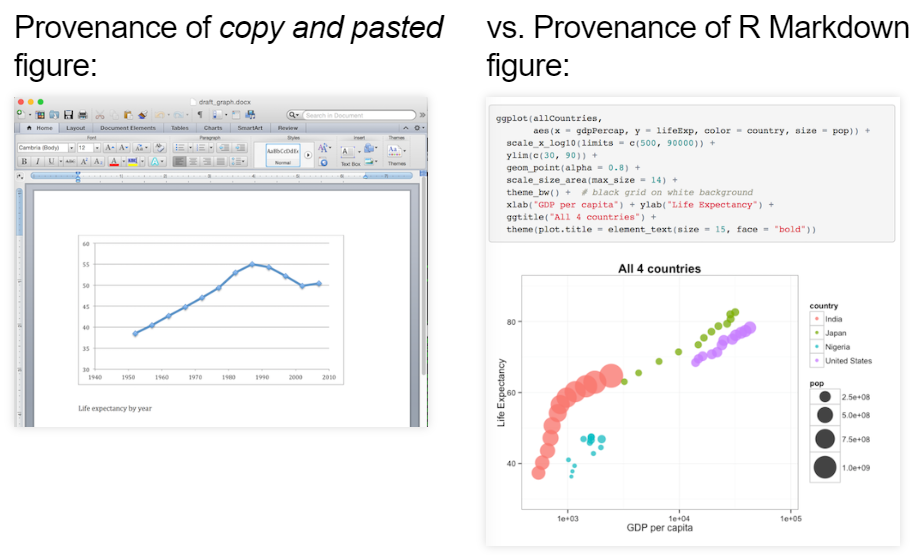 

**Voir** [**Open and Reproducible Science with R**](https://rpubs.com/minebocek/user2017-ors)

## Bonne pratique #4: Automatiser!

- Encore ici, on peut expliquer dans le fichier README comment faire rouler son code et dans quel ordre pour reproduire les résultats, mais c’est encore mieux si on automatise le tout.

- **Tout faire avec un script**: de l'importation des données à la présentation des résultats en passant par les manipulations et l'analyse (si ce n’est pas possible, bien  documenter les étapes pour reproduire les manipulations et la source des données).

- Éviter les étapes manuelles par *point and clic* et copier-coller (ex: supprimer colonnes, renommer variables, supprimer des observations...). Excel et SPSS simplifient la vie mais pose problème pour la documentation et le stockage des procédures.

- S'informer sur les bonnes pratiques de rédaction de scripts (bien commenter/documenter ses scripts, utiliser des **chemins relatifs et non absolus**, faciliter l'intégration de nouvelles données, indiquer le set.seed pour les simulations).

- Automatiser l’exécution de scripts : diviser les scripts selon leurs fonctions et créer un fichier maitre pour coordonner l’exécution et documenter les dépendances de son projet ( [Makefile](http://www.gnu.org/software/make/), [script shell](http://www.gnu.org/software/bash/)).

## Bonne pratique #4: Automatiser!

### Chemin absolu vs relatif

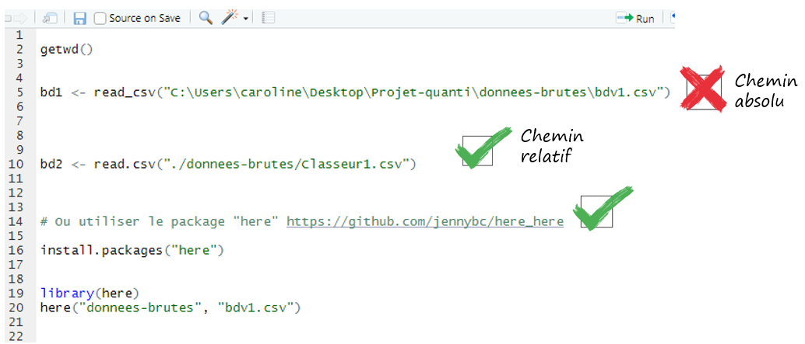

## Bonne pratique #4: Automatiser!

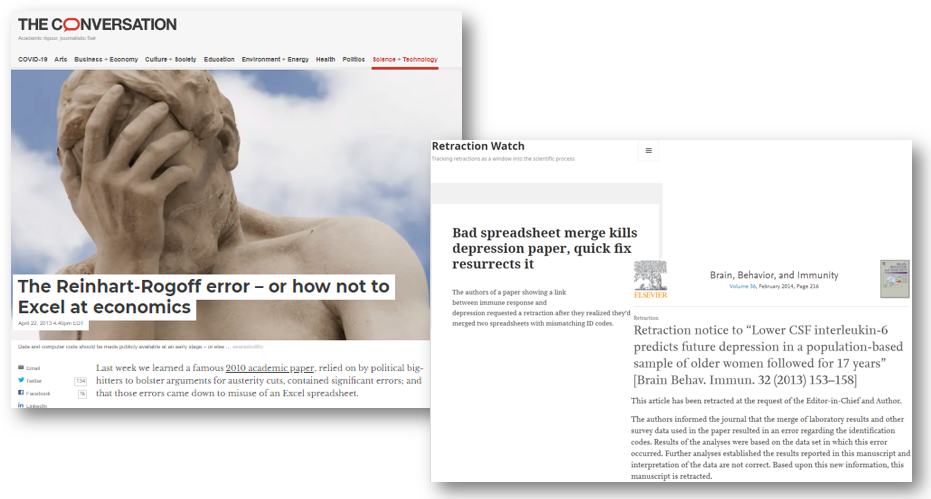

[Problems with using Microsoft Excel for Statistical Analysis & Graphics](http://biostat.mc.vanderbilt.edu/wiki/pub/Main/TheresaScott/StatsInExcel.TAScott.slides.pdf)

## Bonne pratique #4: Automatiser++!

### Adopter la méthode du *litterate programming* (programmation lettrée)

- Paradigme de programmation développé au milieu des années 1980 par Donald E Knuth :

> Treat program as literature to be understandable to human beings

- Principe est que le code et la documentation qui l’explique devaient se trouver dans un même document pour en assurer la reproductibilité donc permettre aux autres chercheurs de comprendre les tâches demandées au logiciel.

- Utiliser des outils pour transformer son code en rapports reproductibles > documents computationnels (notebooks)

Document reliant les résultats, le code qui les a générés et les commentaires qui expliquent chacune des étapes : La source et le chargement données, les modifications et analyses effectuées et les résultats obtenus > toute la chaine peut ainsi être reproduite.

- Existe différents outils selon le langage de programmation utilisé (R, Python) mais le concept reste que l’on mélange dans un même document des blocs de code exécutable avec de la rédaction de texte à l’aide d’un langage de balisage (Markdown ou LaTeX) pour générer des documents en différents formats (word, html, pdf). 

## Bonne pratique #5: Diffuser!

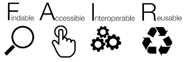 

### 5.1. Pourquoi « ouvrir » ses données?

–	De plus en plus d’éditeurs et d’organismes le suggèrent ou même l’obligent.

–	Communauté scientifique le demande de plus en plus.

–	Recherche de [meilleure qualité](https://journals.plos.org/plosone/article?id=10.1371/journal.pone.0026828) avec [meilleure visibilité](https://peerj.com/articles/175/).

 

#### Quelques conseils :

-	Pour la documentation, le code et les données, privilégier les formats ouverts et non propriétaires pour assurer interopérabilité et préservation à long terme (formats texte comme .csv, .txt, jamais de données en formats pdf/word).
-	Choisir un dépôt de données fiable et pertinent dans sa discipline.
-	Attribuer une licence à ses données pour définir les usages possibles (la moins restrictive possible).
-	Diffuser tout le matériel nécessaire à la reproduction (données, scripts, documentation, rapports non publiés…).
-	Porter une attention particulière à la sensibilité des données (éthique, confidentialité).

[DRYAD - FAIR Data](https://datadryad.org/stash/best_practices)

## Bonne pratique #5: Diffuser!

### 5.2. Diffuser des données bien structurées

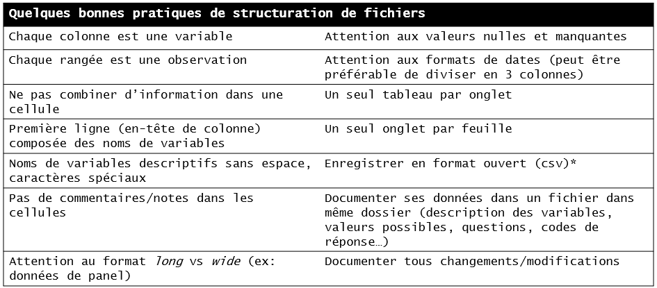

*Attention car le transfert en format texte peut entrainer des pertes d'information sur les variables. Il est conseillé de créer un dictionnaire de codes pour décrire ses variables (peut être automatisé).

Principes de [*Tidy Data*](https://vita.had.co.nz/papers/tidy-data.pdf) (Hadley Wickham)

## 6. Choisir de bons outils

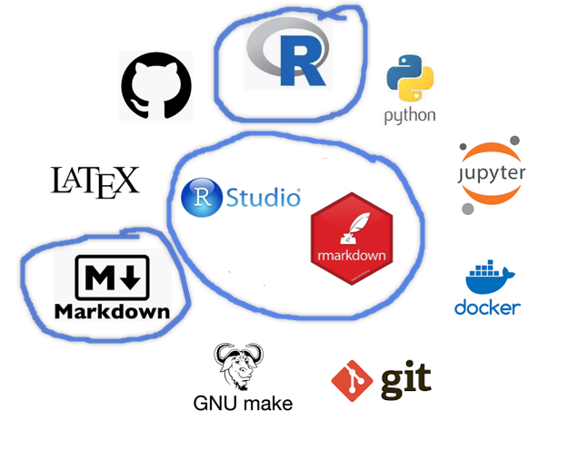

Plusieurs outils de programmation  peuvent être utilisés pour améliorer la reproductibilité de ses analyses. L'important est de choisir un language qui permet à la fois d'automatiser ET documenter ses analyses.

## Références

- Baker,Monya,  26 May 2016, 1",500 scientists lift the lid on reproducibility", *Nature* 533, doi:10.1038/533452a 

- Barba, Lorena A., 2018, "Terminologies for Reproducible Research", arXiv:1802.03311 

- Buckheit, Jonathan B., David L. Donoho, 1995, *WaveLab and Reproducible Research*, Stanford University, https://statweb.stanford.edu/~wavelab/Wavelab_850/wavelab.pdf

- Chen, X., Dallmeier-Tiessen, S., Dasler, R. et al., 2019, "Open is not enough". *Nature Phys*, 15, 113–119, https://doi.org/10.1038/s41567-018-0342-2

- Claerbout, Jon, Martin Karrenbach, 1992, *Electronic Documents Give Reproducible Research a New Meaning*, invited paper at the October 25-29, 1992 meeting of the Society of Exploration Geophysics, http://sep.stanford.edu/oldsep/matt/join/redoc/web/seg92.html

- Desquilbet, Loïc , Sabrina Granger, Boris Hejblum, Arnaud Legrand, Pascal Pernot, Nicolas Rougier, 2019, *Vers une recherche reproductible. Faire évoluer ses pratiques*, https://rr-france.github.io/bookrr/

- Donoho,David L., July 2010, "An invitation to reproducible computational research", *Biostatistics*, 11, 3, 385–388, https://doi.org/10.1093/biostatistics/kxq028

- Gupta, Amarnath,  2009, "Data Provenance", *Encyclopedia of Database Systems*, Ed.: LING LIU, M. TAMER ÖZSU, https://doi.org/10.1007/978-0-387-39940-9_1305

- Ioannidis, John P. A.,  2005, "Why Most Published Research Findings Are False", *Plos Medicine*, https://doi.org/10.1371/journal.pmed.0020124

- King, Gary, 1995, "“Replication, Replication.”" *PS: Political Science and Politics*, 28, 444-452, https://j.mp/2oSOXJL

- Liberman, Mark, 2015, "Replicability vs. reproducibility — or is it the other way around?", *The Language Log*, https://languagelog.ldc.upenn.edu/nll/?p=21956

- Munafò, M., Nosek, B., Bishop, D. et al., 2017,  "A manifesto for reproducible science", *Nat Hum Behav*, 1, 0021, https://doi.org/10.1038/s41562-016-0021

- Peng, Roger D., July 2009, "Reproducible research and Biostatistics", *Biostatistics*, Volume 10, Issue 3, 405–408, https://doi.org/10.1093/biostatistics/kxp014

- Peng, Roger D., 2001, "Reproducible Research in Computational Science", *Science*, 334, 6060, 1226, https://science.sciencemag.org/content/334/6060/1226

- Peng, Roger D.,  Francesca Dominici, Scott L. Zeger, 1 May 2006, "Reproducible Epidemiologic Research", *American Journal of Epidemiology*, 163, 9, 783–789, https://doi.org/10.1093/aje/kwj093

- Piwowar HA, Vision TJ. 2013,  "Data reuse and the open data citation advantage". *PeerJ*, 1 , 175,  https://doi.org/10.7717/peerj.175

- Scott, Teresa, 2009, *Problems with using Microsoft Excel, for Statistical Analysis & Graphics*, CRC Research Skills Workshop, Department of Biostatistics, vanderbilt, http://biostat.mc.vanderbilt.edu/wiki/pub/Main/TheresaScott/StatsInExcel.TAScott.slides.pdf

- Somers, James, April 5 2018, "The Scientific Paper Is Obsolete Here’s what’s next", *The Atlantic*, https://www.theatlantic.com/science/archive/2018/04/the-scientific-paper-is-obsolete/556676/

- Stodden, VictoriaApril 5, 2018, *The Science of Computational Reproducibility*, Speaker Lecture, School of Information Sciences University of Illinois at Urbana-Champaign, https://web.stanford.edu/~vcs/talks/UDel-2018-STODDEN.pdf

- Rui, Sandrine, "Réflexivité", *Sociologie [En ligne], Les 100 mots de la sociologie*, mis en ligne le 01 août 2012, consulté le 30 octobre 2020.,  http://journals.openedition.org/sociologie/1584

- Wicherts JM, Bakker M, Molenaar D, 2011, "Willingness to Share Research Data Is Related to the Strength of the Evidence and the Quality of Reporting of Statistical Results". *PLoS ONE* 6(11): e26828. https://doi.org/10.1371/journal.pone.0026828

